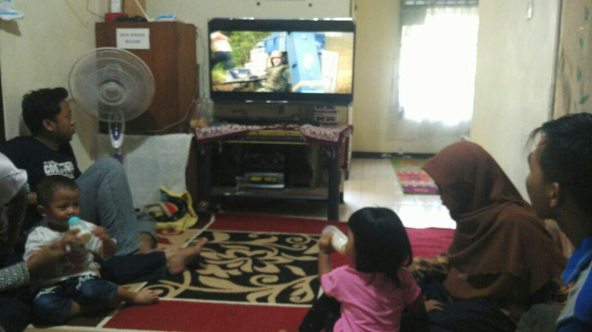
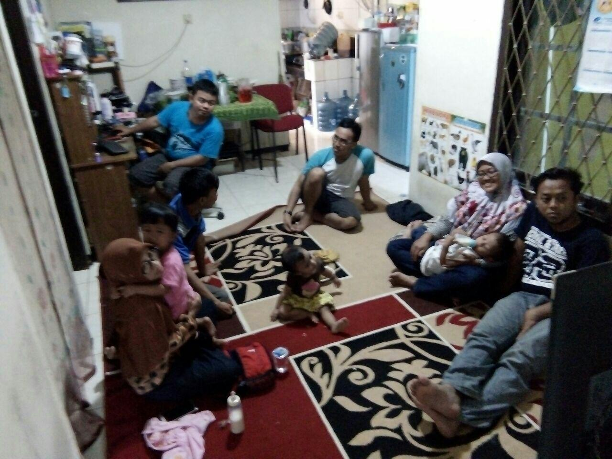
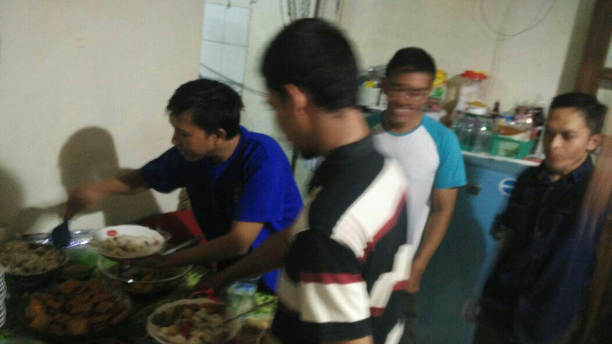
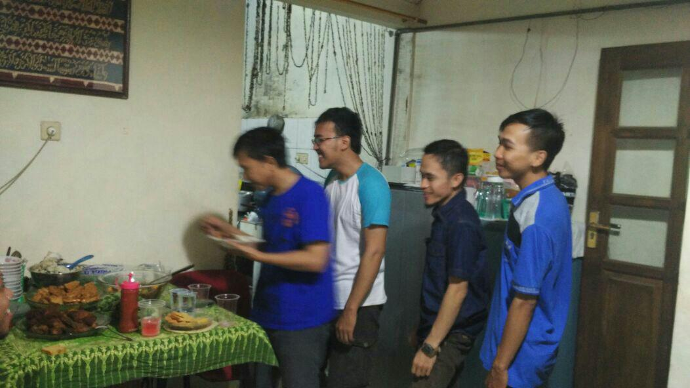
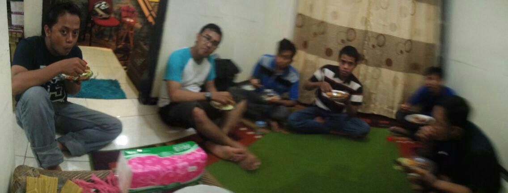
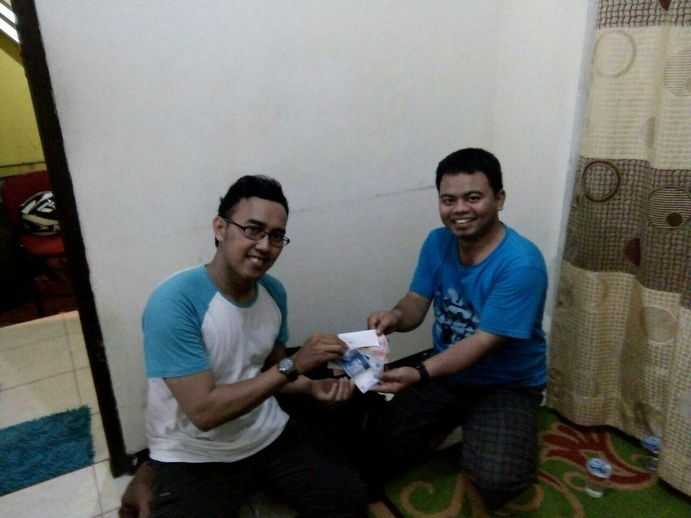
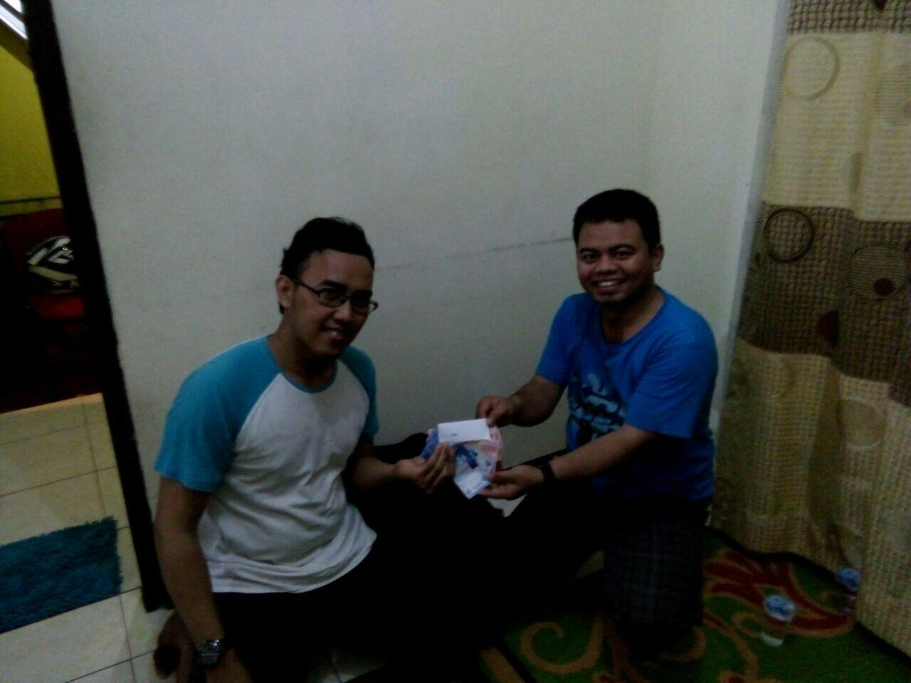
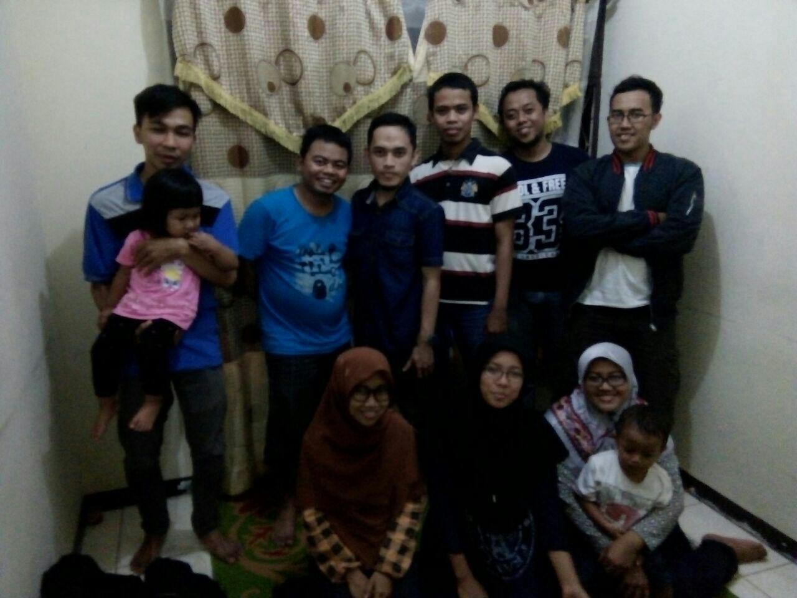

Arisan diadakan tanggal 10 Juni 2017 di Rumah Pandu di Rawa Lumbu, Bekasi.
Dan yang dapat Arisan pada kocokan kedua adalah Heri Ahmadi dan Sahal Muntaha.

Berikut beberapa dokumentasi acaranya :

<small>_Keterangan foto :_</small>

 

<small>_Keterangan foto :_</small>

<small>_Keterangan foto :_</small>

<small>_Keterangan foto :_</small>

<small>_Keterangan foto :_</small>

<small>_Keterangan foto :_</small>

<small>_Keterangan foto :_</small>

<small>_Keterangan foto :_</small>

<small>_Keterangan foto :_</small>
