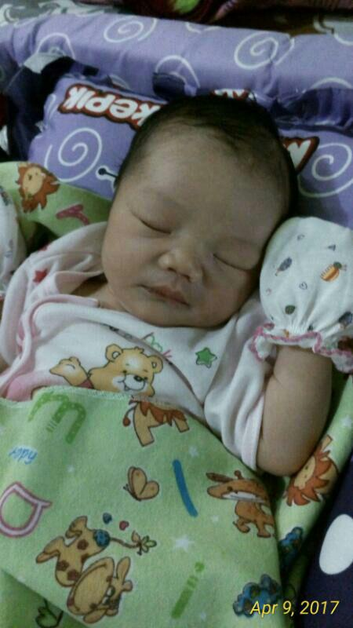
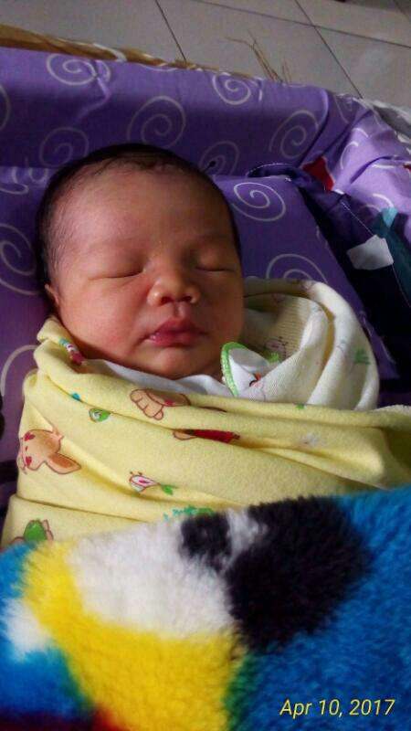
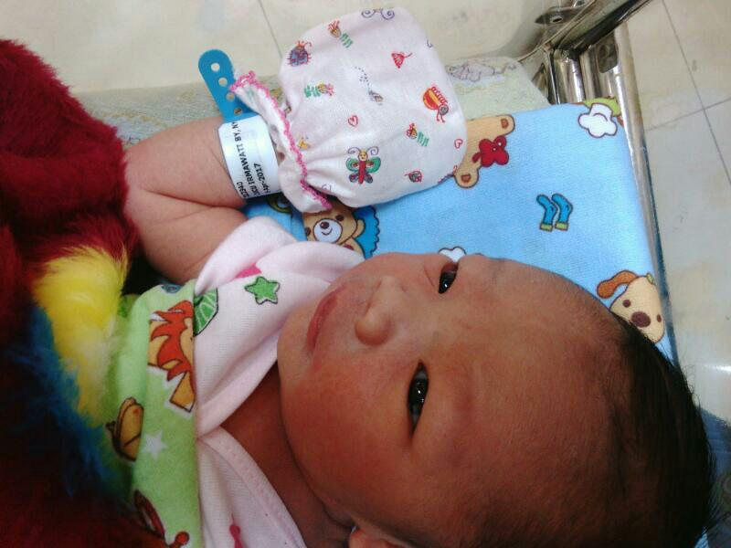
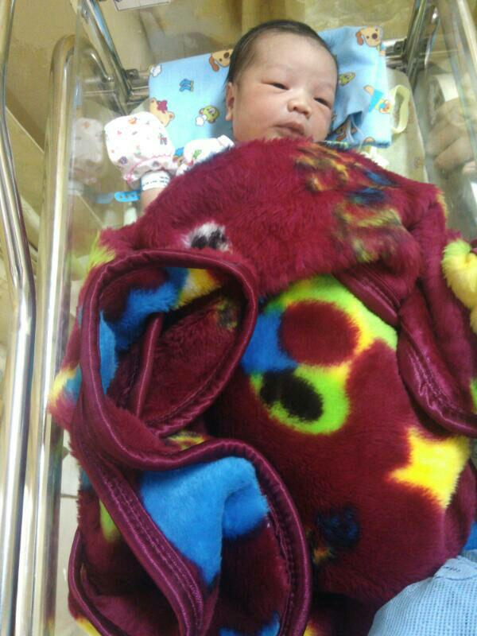
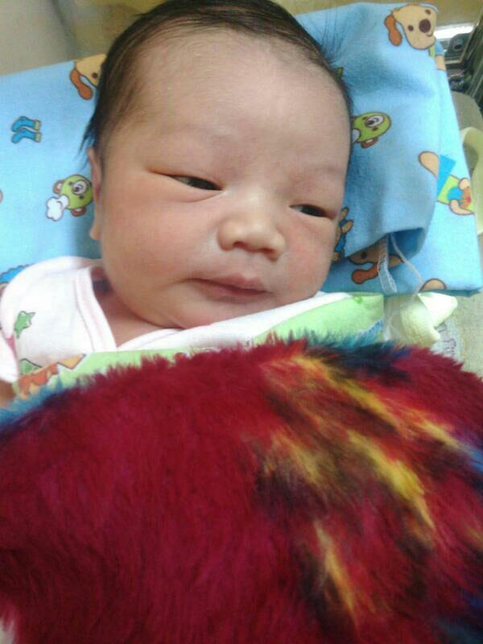

Setiap kelahiran seorang anak merupakan kebahagiaan bagi kedua orang tua-nya, pun begitu bagi kami dalam menyambut anggota keluarga baru kami FT-UMJ-IV. 
Sodara kami <b>Akhmad Syafrul Afandi</b> tengah mendapatkan kebahagiaan tersebut dengan kelahiran anak pertamanya yang berjenis kelamin laki-laki pada tanggal <b>08-April-2017 jam 23:00 WIB</b>, yang Insya Allah akan di beri nama <b>Irham Sadri Afandi</b>.

  

Selamat sodara syafrul beserta istri dan seluruh keluarga besar atas kelahiran putra pertamanya.
Semoga kelahiran putra pertama ini membawa berkah bagi kehidupan kalian kedepannya.
Semoga anak tersebut bisa menjadi anak yang soleh, berbakti pada kedua orang tua, berguna bagi agama, masyarakat dan negara kelak.
Semoga sodara syafrul dan istrinya bisa menjadi orang tua yang baik, agamis, dan pada akhirnya bisa mendidik anaknya dengan baik pula.

  

Kami seluruh anggota FT-UMJ-IV dengan ini ikut bersuka cita atas lahirnya keluarga baru ditengah-tengah kami.
Semoga kebahagiaan ini membawa sesuatu yang baik dan baru pula bagi kami dan semua anggota seluruhnya. 

 

Amiin...

 

<small>_Keterangan foto :_</small>

<small>_Keterangan foto :_</small>

<small>_Keterangan foto :_</small>

<small>_Keterangan foto :_</small>

<small>_Keterangan foto :_</small>

